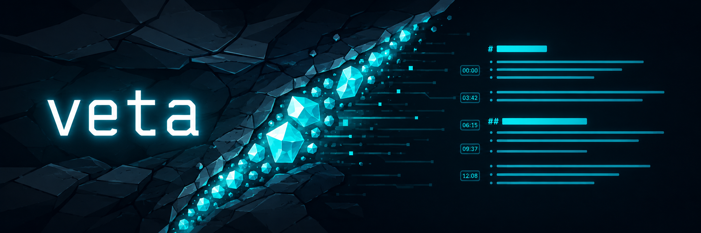

<p align="center">
  
</p>

# veta

Turn a YouTube URL into a clean, chaptered Markdown transcript — ready for you
or an AI agent to turn into real notes.

YouTube gives you **subtitles**: thousands of two-second fragments stuffed with
timing metadata. veta turns that noise into readable paragraphs, keeps the
video's chapters as headings, and deep-links every paragraph back to the exact
second in the video.

```sh
npm install -g @cmglezpdev/veta
veta doctor
veta "https://www.youtube.com/watch?v=Zdus-d4ehN0"
```

Prints the path to something like:

```text
ai-replacing-developers-has-officially-failed/transcript.md
```

## What you get

A folder named from the video title, containing `transcript.md`:

```markdown
# AI Replacing Developers Has Officially Failed

*Sajjaad Khader · 14:48 · https://www.youtube.com/watch?v=Zdus-d4ehN0*

## 1. Why Big Tech’s AI Experiment Failed

[`0:00`](https://www.youtube.com/watch?v=Zdus-d4ehN0&t=0) Big tech is in big
trouble. For years, they bet that AI would replace …

## 2. The Software Engineering Market Before AI

[`1:06`](https://www.youtube.com/watch?v=Zdus-d4ehN0&t=66) what's happening
with AI in this tech market …
```

That file is the product today. Hand it to Cursor, Claude Code, Obsidian, or
whatever you already use — veta does not write the notes for you.

Next to it, veta writes `prompt.md`: ready-made instructions for an AI
assistant working in that folder to turn `transcript.md` into structured,
timestamp-cited study notes. In an interactive terminal, `veta` offers to
copy the prompt after printing the transcript path — press Enter to accept,
anything else skips. Set `VETA_CLIPBOARD_CMD` to route the copy through a
custom command (it receives the text on stdin) instead of the platform
clipboard tool.

## Quick path

1. **Node 24+** and a working [`yt-dlp`](https://github.com/yt-dlp/yt-dlp)
   on your `PATH` (`brew install yt-dlp` or `pipx install yt-dlp`).
2. Install the CLI:

   ```sh
   npm install -g @cmglezpdev/veta
   # or: pnpm add -g @cmglezpdev/veta
   ```

3. Check the extraction source:

   ```sh
   veta doctor
   ```

4. Extract:

   ```sh
   veta "https://www.youtube.com/watch?v=VIDEO_ID"
   # same thing:
   veta extract "https://www.youtube.com/watch?v=VIDEO_ID"
   veta extract VIDEO_ID --lang en
   ```

By default the package folder is created in the current working directory.
Override with `VETA_DATA_DIR`:

```sh
VETA_DATA_DIR=~/Notes/youtube veta "https://www.youtube.com/watch?v=VIDEO_ID"
```

Re-running the same video is safe: a finished extraction returns its existing
`transcript.md` without touching the network, and an interrupted one resumes
in the same package folder instead of starting over. Pass `--force` to discard
prior progress and extract from scratch — it removes only files veta writes,
never anything else you keep in the folder.

## Commands

| Command | What it does |
|---|---|
| `veta <url>` | Extract captions → normalized `transcript.md` |
| `veta extract <url> [--lang <code>]` | Same, with an explicit preferred language (BCP-47) |
| `veta extract <url> --force` | Re-extract from scratch, discarding prior progress |
| `veta doctor` | Show which `yt-dlp` binary will be used |
| `veta completion` | Print a shell completion script (zsh/bash) |

## Requirements

| Need | Why |
|---|---|
| Node.js ≥ 24 | Runtime floor for the published package |
| `yt-dlp` on `PATH` (recommended) | Fetches metadata + captions; keep it updated yourself |
| Captions on the video | No ASR fallback — if YouTube has no caption track, veta fails clearly |

Point at a specific binary with `VETA_YTDLP_PATH` if needed.

## Status (v0.4)

**Works today:** pick the right caption track, download via yt-dlp, normalize
into chaptered Markdown with deep links, generate `prompt.md` with note-taking
instructions (Enter to copy it to your clipboard), resume interrupted runs and
re-run safely (`--force` to start over), ship as `@cmglezpdev/veta`.

**Not yet:** progress UI, config persistence, or launching an AI agent. Those
are next — see [docs/08-roadmap.md](docs/08-roadmap.md).

veta will never generate the notes itself. It extracts, cleans, and hands off.

## Learn how it works

The `docs/` folder is the real teaching material — design decisions with
evidence, not marketing:

| Start here | |
|---|---|
| [Concepts](docs/01-concepts.md) | Subtitles ≠ transcripts; the five words you need |
| [Architecture](docs/02-architecture.md) | Layers and the import rule |
| [Normalization](docs/04-normalization.md) | 2,580 fragments → continuous text |
| [Segmentation](docs/05-segmentation.md) | Where paragraphs break, and why |
| [Roadmap](docs/08-roadmap.md) | What ships next |

Product intent lives in [`PRD.md`](PRD.md).

## Develop from source

Use **pnpm 11.17.0** (pinned in `package.json` as `packageManager`). Newer pnpm
versions may work, but this repo is tested against 11.17 — enable it with
Corepack:

```sh
corepack enable
corepack prepare pnpm@11.17.0 --activate
```

If global installs fail with “bin directory … is not in PATH”, run `pnpm setup`
once and reload your shell (`source ~/.zshrc`).

```sh
pnpm install
pnpm test
pnpm build
pnpm add -g .        # register the local `veta` bin globally
veta doctor
```

`pnpm link --global` was removed in pnpm 11; use `pnpm add -g .` instead. To
remove the local global install: `pnpm remove -g @cmglezpdev/veta`.

Details: [docs/06-development.md](docs/06-development.md).
Releases: [docs/07-releasing.md](docs/07-releasing.md).

## License

MIT
